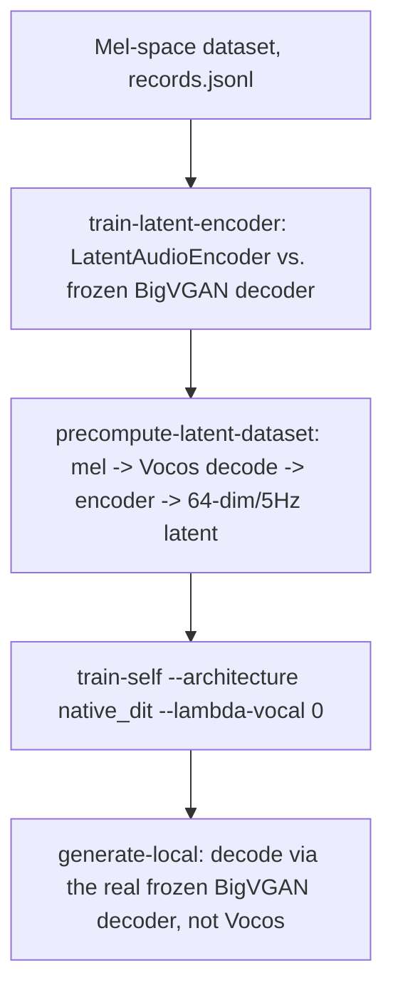

# Architecture

GenMusic VN generates Vietnamese vocal audio from a lyric prompt and a style
description, via Conditional Flow Matching (CFM). It supports two student
backbones and two feature spaces — pick one axis independently of the other.
This file is the technical reference; `docs/project_history.md` is the
narrative of how it got here (bugs found, experiments run, dead ends).

## Workflow

```mermaid
flowchart TD
    A[Lyric and style text] --> B[Text normalization and timing]
    C[WAV or MP3 collection] --> D[Demucs stem separation, batched+resumable]
    C --> S[MuQ-MuLan style embedding]
    D --> E[Whisper transcription + segment timestamps]
    D --> M2[Mel extraction, Vocos-native format]
    B --> F[records.jsonl]
    E --> F
    M2 --> F
    S --> F
    F --> G[Dataset validation]
    G --> I[Student CFM training: train-self --architecture microdit|native_dit]
    G --> DI[MicroDiT distillation from real DiffRhythm2 teacher: train-distill]
    I --> J[Local sampling + Vocos rendering]
    DI --> J
    A --> K[Kaggle job staging]
    K --> L[GPU training or inference]
    L --> M[Output MP3/WAV and reports]
```

**Native latent path** (an alternative to raw mel — see "Native latent
backbone" below):



## Source Mapping

- `src/data/vietnamese_text.py` — lyric normalization.
- `src/data/lyric_alignment.py` — lyric timing and LRC helpers.
- `src/data/preprocess_raw_vietnamese.py` — recursive audio discovery, Demucs
  separation, Whisper transcription, Mel tensor export.
- `src/data/precompute_latent_dataset.py` — converts an existing mel-space
  dataset into a latent-space one (64-dim/5Hz) using a trained
  `LatentAudioEncoder` checkpoint.
- `src/models/text_to_music_diffusion.py` — `MusicDiffusionConfig` (including
  `latent_mode`), mel/waveform conversion, `reconstruct_full_mix`, checkpoint
  I/O.
- `src/models/dit_transformer.py` — `MicroDiT`, the default student backbone.
- `src/models/diffrhythm2_native.py` — `NativeDiTStudent`, the alternative
  backbone (selected via `--architecture native_dit`).
- `src/models/latent_codec.py` — `LatentAudioEncoder`, `load_frozen_decoder`,
  `multi_scale_mel_loss`.
- `src/models/cfm_flow.py` — the CFM loss (`cfm_loss`) and Euler sampler
  (`sample_cfm`), shared by both backbones.
- `src/training/self_diffusion.py` — dataset contract, train/validation
  split, early-stopping, the training loop used by both `train-self`
  architectures.
- `src/training/latent_encoder_training.py` — pretrains `LatentAudioEncoder`
  against the frozen decoder.
- `src/training/distill_training.py` — `train-distill`'s teacher-matching
  loss (MicroDiT only).
- `src/integrations/kaggle_auto.py` — Kaggle dataset/job staging.
- `src/evaluation/` — objective audio metrics and report plots.
- `cli.py` — command-line entry point.
- `server.py` — small standard-library HTTP backend for the web demo.

## Dataset contract

Each dataset directory has `config.json`, `records.jsonl`, and tensors under
`mels/`. Current records provide `vocal_mel_path`, `backing_mel_path`, and
`style_embed_path` (a precomputed 512-dim MuQ-MuLan embedding). In a
mel-space dataset, `vocal_mel_path`/`backing_mel_path` hold Vocos-native mel
tensors (100 mels, 24kHz, n_fft=1024, hop=256 — see
`docs/data_preparation.md` and §"Mel and vocoder" below for why this exact
format matters). In a latent-space dataset (`config.json`'s `latent_mode:
true`, produced by `precompute-latent-dataset`), the same path instead holds
a 64-dim/5Hz latent tensor, and `backing_mel_path` is unused (the full mix is
already baked into the one latent).

## Student backbone 1: MicroDiT (`--architecture microdit`, default)

`MicroDiT` (`src/models/dit_transformer.py`) predicts the CFM velocity field
for a noisy mel sequence, conditioned on lyrics (cross-attention) and style
(additive). Default size `dim=256, depth=4, heads=4` (~5.6M trainable
parameters); configurable via `--dim`/`--depth`/`--heads`/`--ff-mult`.

**Lyric conditioning — cross-attention, not concatenation.** Text is encoded
by `PretrainedPhonemeEncoder`: `text2phonemesequence` G2P's each lyric string
into IPA-style phonemes (Vietnamese-aware — this is the step that gives the
model any real notion of Vietnamese pronunciation/tone), then a **frozen**
`vinai/xphonebert-base` transformer encodes the phoneme sequence, followed by
a small trainable 2-layer projection to `dim`. Each `CrossAttentionDecoderLayer`
in the backbone keeps self-attention restricted to the mel sequence alone
(so rotary positions and the attention mask are just plain mel-frame
positions), and adds a dedicated `nn.MultiheadAttention` sublayer where mel
queries attend to the text keys/values. This replaced an earlier
"prepend"-style design (text and mel tokens sharing one self-attention
sequence) after SongGen (arXiv:2502.13128) reported cross-attention lyric
conditioning clearly beating that (FAD 1.73 vs 3.56, PER 43.34 vs 56.21).

**No backing-track conditioning.** `InputEmbedding` only ever sees the mel
tensor (`x_proj = proj_x(x)`, then style/time added additively) — there is no
`backing_mel` input to the model at all. This is a real, deliberate
simplification versus an earlier design that fed a per-frame backing-mel
tensor as conditioning.

**But the training *target* is still the full mix, not vocal-only.**
`cfm_loss` builds `x1` via `reconstruct_full_mix(vocal_mel, backing_mel,
config)` — summing the linear-magnitude mel energies of the (Demucs-separated)
vocal and backing stems, then re-logging — except in `latent_mode`, where
`vocal_mel_path` already holds the full-mix latent directly and no summing is
needed. So the model is trained to predict a full song's velocity field from
an *unconditioned* starting point (no backing input), while a separate
auxiliary head (`vocal_proj_out`, "Mixed Pro" from SongGen) is trained
alongside on the vocal-only velocity so the model doesn't neglect the
quieter, sparser vocal signal in favor of the louder accompaniment.

**Style conditioning** is a single 512-dim MuQ-MuLan embedding
(`AudioStyleEncoder`, a small MLP), added additively at the input embedding
and again at the final `AdaLayerNormZeroFinal`.

**REPA hook**: `MicroDiT` always constructs a `repa_head` (projects a chosen
intermediate hidden state to 1024-dim) but it's a no-op unless a caller
passes `repa_layer_idx` — used only by `train-distill`'s optional REPA loss
(see below), not by `train-self`.

## Student backbone 2: `NativeDiTStudent` (`--architecture native_dit`)

`src/models/diffrhythm2_native.py` is a vendored (Apache 2.0, attributed)
port of DiffRhythm2's *own* backbone shape, for use as an alternative
student — same call signature as `MicroDiT`, same CLI flags
(`--dim/--depth/--heads/--ff-mult`), same `cfm_loss`/training loop.

Mechanically the opposite conditioning choice from `MicroDiT`: text and audio
share **one concatenated self-attention sequence** instead of cross-attention.
Forward pass:
1. G2P + tokenize lyrics (same `text2phonemesequence` step as `MicroDiT`, but
   feeding a **from-scratch-trained** `nn.Embedding` rather than a frozen
   pretrained transformer).
2. `text_emb = TextEmbedding(token_ids)` → `(B, text_len, 512)`;
   `audio_emb = latent_embed(x)` → `(B, audio_len, 512)`.
3. `combined = cat([text_emb, audio_emb], dim=1)` — the shared sequence.
4. Time: text positions get a sentinel `-1.0`; audio positions get the real
   per-sample CFM timestep. Position ids are **two independent `0..N-1`
   ranges** (text and audio each restart at 0), matching DiffRhythm2's own
   first-inference-block behavior.
5. Attention mask is fully bidirectional over `[text; audio]`, masking only
   text padding — no block-wise clean/noisy split (that mechanism exists only
   in `train-distill`'s teacher-replication path, see below).
6. `depth` × `LlamaNARDecoderLayer` (standard pre-norm Llama block with a
   learned per-head RMSNorm on Q/K on top of RoPE self-attention), one shared
   `LlamaRotaryEmbedding` for the whole stack.
7. `AdaLayerNormZero_Final` modulated by the timestep embedding only (style
   was already added once, at step 3's projection); `proj_out`; **text
   positions' outputs are discarded**, only the audio slice is returned.

Cost/benefit measured empirically (`docs/project_history.md` §4.19): at
matched size/epoch, this sequence-concatenation design does not improve
ground-truth CFM loss over `MicroDiT`, is **~4.4x slower** per step
(attention over a longer combined sequence, plus G2P running on CPU each
batch), but does shift output statistics (`voiced_ratio` down, `pitch_std`/
spectral flatness closer to real vocals) — a real trade-off, not a clear win,
independent of the native-latent-space work below.

## Native latent backbone and encoder (`latent_mode`)

The teacher (DiffRhythm2) does not operate on mel-spectrograms: it runs on
**64-dimensional latents from its own Music VAE, at 5 Hz** — a ~19x lower
frame rate than the student's usual 100-dim/93.75Hz raw mel. Giving the
student that same compressed space (rather than only resampling the
*teacher-query* side during distillation, see below) needed two new pieces:

- **`LatentAudioEncoder`** (`src/models/latent_codec.py`) — DiffRhythm2
  publishes its **decoder** (BigVGAN, `decoder.bin`/`decoder.json` on
  HuggingFace `ASLP-lab/DiffRhythm2`) but not its VAE encoder. Rather than
  training a full paper-faithful VAE (adversarial discriminators — too
  costly/risky for this project's data budget), this encoder is trained from
  scratch with a plain reconstruction loss against the real, **frozen**
  decoder (`train-latent-encoder`). Architecture: `Conv1d(1→32)` stem, five
  `_DownsampleBlock`s (each three dilated residual units + a strided
  downsample conv) with strides `(10,10,8,3,2)` — product 4800, matching the
  paper's stated encode-side compression ratio — channels doubling
  `32→64→128→256→512` (capped at 512), then `Conv1d(512→64)`. Loss
  (`multi_scale_mel_loss`) is the unweighted average of L1-on-log-mel across
  three STFT scales, `(n_fft, n_mels) ∈ {(512,40), (1024,80), (2048,80)}` —
  no adversarial term.
- **`precompute-latent-dataset`** and `MusicDiffusionConfig.latent_mode`
  wire an existing mel dataset into this space; `render_mel_to_wav()`
  branches on `latent_mode` to decode through the frozen BigVGAN decoder
  directly instead of Vocos.

**Failure mode hit once already, worth knowing before retraining this
encoder**: with a flat learning rate and no gradient clipping, the loss
curve oscillated instead of converging, and the resulting encoder collapsed
— ground-truth latents decoded to a near-monotone, single-pitch signal
(`pitch_std_semitones` ≈0.9, despite not being literal noise by spectral
flatness). Fixed with LR warmup (`--warmup-steps`, default 200) + cosine
decay + gradient-norm clipping (`--grad-clip-norm`, default 1.0), now the
default training recipe. **Always sanity-check a retrained encoder** by
decoding a few ground-truth latents directly (bypassing the CFM student
entirely) and checking `pitch_std_semitones` via
`scripts/evaluate_generation_quality.py`'s `wav_metrics` before trusting any
downstream CFM training run — see `docs/project_history.md` §4.24 for the
full incident and the before/after numbers.

## Conditional Flow Matching (shared by both backbones)

`cfm_loss` (`src/models/cfm_flow.py`) implements rectified-flow training:
`x0 ~ N(0,I)`, `xt = (1-t)x0 + t·x1` for `t ~ U(0,1)`, target velocity
`x1 - x0`. On top of the base MSE, several terms are combined:

- **Frame-activity reweighting**: frames above the 55th-percentile energy
  quantile get up to 3x the loss weight of quiet frames (renormalized to
  mean 1 per sample) — prevents silence-dominated frames from swamping the
  gradient.
- **`loss_gt = velocity_loss + 0.15·reconstruction_loss + 0.05·(time_delta +
  frequency_delta)`** — `reconstruction_loss` is L1 between the one-step
  reconstructed clean sample and `x1`; the delta terms are L1 on the
  first-difference along time/mel-bin axes. This combination (added to fight
  a real regression-to-the-mean/"distributional averaging" failure mode —
  see `docs/project_history.md` §4.11-4.13) is what most directly determines
  output diversity; changing these weights changes the collapse/diversity
  trade-off directly.
- **Vocal-auxiliary loss** (`--lambda-vocal`, default 1.0): same recipe
  against the vocal-only velocity target, using the model's second output
  head. Recommended `--lambda-vocal 0` in `latent_mode`, since only one
  latent per record is precomputed (no separate vocal-only latent target).
- **Lyric-content-sensitivity terms** (`train_model`'s own defaults:
  `text_contrastive_weight=0.08`, `text_sensitivity_weight=2.0` — these are
  *disabled* at `cfm_loss`'s own function-signature level and only enabled by
  `train_model`): builds a batch of mismatched lyrics (`build_mismatched_texts`,
  rotates each sample to a different sample's non-empty lyric), and penalizes
  the model if swapping the lyric doesn't change its prediction enough — a
  contrastive hinge (matched error should be lower than mismatched error by
  at least a margin) plus a sensitivity floor (relative response to a lyric
  swap should exceed `text_sensitivity_target=0.20`). This is also the gate
  used to decide whether a checkpoint counts as "the best one" during
  training (see below) — a checkpoint with good validation loss but a model
  that ignores lyrics entirely does not pass the gate.

Sampling (`sample_cfm`) is fixed-step Euler integration (default `--steps
32`), with optional classifier-free guidance (`--guidance-scale`, an extra
unconditional forward pass extrapolated against the conditional one).

## Training loop, validation, and early stopping (`train-self`, both architectures)

`src/training/self_diffusion.py`'s `train_model()` drives both backbones
identically — same loss, same optimizer/scheduler/EMA, same early-stopping
machinery; only the model class differs.

- **Song-level train/validation split** (`split_training_records`): each
  record is assigned to train or validation by a deterministic hash of
  `f"{seed}:{record_id}"` — stable across resumes, no random-module state to
  lose. Default `validation_fraction=0.05`, capped at
  `validation_max_records=128`.
- **Checkpoint-improvement gate** (`_is_checkpoint_improvement`): a
  checkpoint only counts as "best" if validation CFM loss improves by more
  than `early_stopping_min_delta` (0.001) **and** the lyric-sensitivity
  metric (`evaluate_text_sensitivity`, EMA-weighted) is at or above a floor
  (default `0.90 * text_sensitivity_target`). A model that improves
  validation loss by becoming *less* responsive to its lyric input does not
  pass.
- **Early stopping**: triggers once `completed_epochs >= minimum_epochs`
  (default 8) **and** `epochs_without_improvement >= early_stopping_patience`
  (default 4) — i.e. training runs until the validation-gated checkpoint
  metric plateaus, not a fixed epoch count (pass a large `--epochs` cap and
  let this decide).
- **LR schedule**: linear warmup over 5% of total steps, then cosine decay to
  10% of peak LR. **EMA**: decay 0.999, used for both validation evaluation
  and the saved checkpoint. **Mixed precision**: autocast fp16 + GradScaler
  on CUDA; gradient clipping fixed at norm 1.0.
- Several of the hyperparameters above (`style_dropout_prob`,
  `text_dropout_prob`, `text_contrastive_*`, `text_sensitivity_*`,
  `validation_*`, `early_stopping_*`) are `train_model()`-level Python
  defaults, not currently exposed as `cli.py train-self` flags — change them
  by calling `train_model()` directly if you need something other than the
  defaults above.

## Distillation (`train-distill`, MicroDiT only)

`src/training/distill_training.py` replicates DiffRhythm2's real teacher call
contract — `KnowledgeDistillationTrainer` always instantiates a `MicroDiT`
student (there is currently no `native_dit` option for distillation).

- **Teacher-rate bridging**: `_resample_time_dimension` linearly resamples
  between the student's 93.75Hz and the teacher's native 5Hz before/after the
  teacher call (a real out-of-distribution bug once existed here — the
  teacher was being fed sequences ~19x longer than anything in its own
  training distribution — see `docs/project_history.md` §4.20).
  `_build_block_attn_mask` replicates the teacher's block-autoregressive
  attention pattern over a `[Text, Clean, Noisy]` layout (clean context
  attends causally by block; noisy queries attend only to strictly-earlier
  clean blocks and their own block's noisy frames) — this is the mechanism
  `NativeDiTStudent` deliberately avoids by using one single global timestep
  instead of a block-wise clean/noisy split.
- **Mel-dim bridge**: `_resize_mel_bins` (fixed linear interpolation, not
  trained) resamples 100↔64 mel bins for the teacher call; a trainable
  `from_teacher_mel: Linear(64,100)` maps the teacher's output back into the
  student's space for the loss (kept outside `torch.no_grad()` deliberately
  — wrapping it would silently zero its gradient, a bug this project hit
  once already).
- **Mixed loss**: `loss = (1 - alpha_feature)·loss_velocity + alpha_feature·loss_gt`
  if the teacher loaded, else `loss_gt` alone (forced `alpha_feature=1.0`).
  `loss_velocity` is **L1** (not MSE — chosen to avoid MSE's tendency toward
  blurry/averaged predictions, per Dieleman 2024 and DMD/ADM). Default
  `alpha_feature=0.5`; `docs/project_history.md` §4.14 found `≈0.8` to be a
  real, multi-song-verified optimum, not noise. Vocal-aux loss (weight
  `lambda_vocal`, default 1.0) and an optional REPA loss (weight `beta_repa`,
  default 0.0, disabled) are added on top unconditionally.
- **Honest fallback, no silent teacher**: if the real teacher or its lyric
  tokenizer can't be loaded (no internet, DiffRhythm2 repo not on
  `PYTHONPATH`), `train-distill` raises immediately rather than silently
  training ground-truth-only under the distillation name. Use `train-self`
  for that.
- **Note on stale prior documentation**: an earlier iteration of this
  project's history describes a `beta_attention` (attention-matrix
  distillation) loss term. It does not exist in the current file — only
  `alpha_feature`, `lambda_vocal`, and `beta_repa` are real loss-weight knobs
  today. Treat `docs/project_history.md` §4.23 as a historical record of a
  design that was implemented and later removed/superseded, not as a
  description of current behavior.

## Mel and vocoder

Mel tensors match Vocos's own native feature extractor exactly
(`charactr/vocos-mel-24khz`: 100 mels, 24kHz, n_fft=1024, hop=256, magnitude
mel with `power=1`, natural log with a `1e-7` floor, no upper clip) — see
`compute_mel_spectrogram()` in `src/models/text_to_music_diffusion.py`. This
specific match matters a lot in practice: an earlier 64-mel/16kHz/log-power
convention was the root cause of severely distorted generated audio (fixed,
verified to restore >0.99 log-mel correlation on real audio — see
`docs/project_history.md` §4.1). `--vocoder vocos` (default) decodes the mel
unmodified; `griffinlim` (64 iterations) is the fallback if Vocos is
unavailable or the config doesn't match. In `latent_mode`, neither is used —
`render_mel_to_wav` decodes through the real frozen BigVGAN decoder instead.

## Checkpoints

`save_checkpoint` excludes frozen, re-downloadable weights (XPhoneBERT) from
the saved file — a checkpoint is the trainable weights plus enough metadata
(`roberta_model`, `architecture`, mel config) to reconstruct the exact model
on load. This keeps checkpoints around 50-100MB instead of >1GB.

## Important evaluation boundary

Random/synthetic mel data can verify tensor shapes, optimization, checkpoint
loading, and audio rendering. It cannot demonstrate natural singing,
Vietnamese intelligibility, or musical quality — those claims require real
audio with valid vocal stems and lyric metadata, and, even then, a human
listening to the output. Automated sanity stats (peak amplitude, RMS,
silence ratio, spectral flatness, voiced ratio, pitch-std) catch crashes and
some classes of degenerate output; they are not a substitute for listening,
and `docs/project_history.md` records more than one case where a metric
looked good while the audio still sounded wrong (or vice versa).
