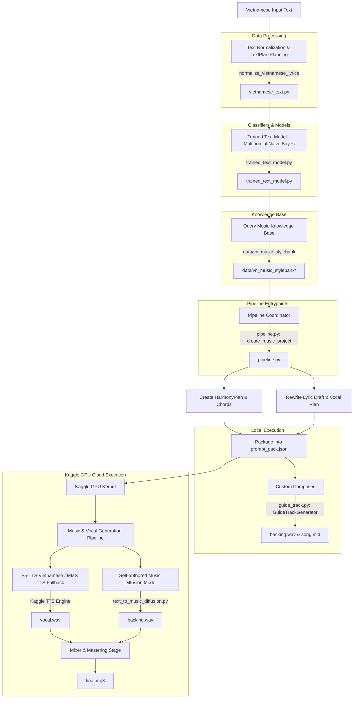

# System Architecture & Pipeline Workflow

GenMusic VN uses a hybrid system topology where processing is divided between local CPU execution and Kaggle GPU cloud execution.

## Pipeline Workflow & Code Mapping

The diagram below maps the execution stages to specific source files and modules in the codebase:

---

## Technical Stages & Source Code References

Here is the direct mapping of each pipeline component to its implementation in the codebase (paths are relative to the project root):

### 1. Input Processing & Language Analysis
- **Text Normalization:** Handled by [genmusic_vn/data/vietnamese_text.py](../genmusic_vn/data/vietnamese_text.py) using the function `normalize_vietnamese_lyrics`.
- **Grapheme-to-Phoneme (G2P):** Converts Vietnamese lyrics into phonetic representations using [genmusic_vn/data/vietnamese_g2p.py](../genmusic_vn/data/vietnamese_g2p.py) (`vietnamese_g2p`).
- **Lyric Forced Alignment:** Aligns audio timing with lyric phrases using [genmusic_vn/data/lyric_alignment.py](../genmusic_vn/data/lyric_alignment.py) (`align_wav_to_lyrics`).

### 2. Emotion & Genre Classification
- **Classification Engine:** Built within [genmusic_vn/integrations/trained_text_model.py](../genmusic_vn/integrations/trained_text_model.py) using Multinomial Naive Bayes (`train_text_model` and `predict_text_model`).
- **Music Theory Mappings:** Fetches keys, chords, and tempos matching the classified emotion from the [data/vn_music_stylebank/](../data/vn_music_stylebank/) directory.

### 3. Execution Coordinator
- **Local Pipeline Orchestration:** Coordinated by [genmusic_vn/core/pipeline.py](../genmusic_vn/core/pipeline.py) via the entrypoint function `create_music_project`.
- **CLI Commands Router:** Managed by [genmusic_vn/cli.py](../genmusic_vn/cli.py).
- **Web UI & REST APIs:** Served by [genmusic_vn/server.py](../genmusic_vn/server.py) (`GenMusicHandler`).

### 4. Background Music Generation
- **Local Waveform & MIDI Composer:** Synthesizes waveforms and outputs MIDI tracks using [genmusic_vn/core/generators/guide_track.py](../genmusic_vn/core/generators/guide_track.py) (implements `GuideTrackGenerator`, `render_wav`, and `render_midi`).
- **Self-authored Music Diffusion Model:** Uses a conditional Conv1D denoising network defined in [genmusic_vn/models/text_to_music_diffusion.py](../genmusic_vn/models/text_to_music_diffusion.py) (`ResidualDenoiser`, `TextConditioner`, `sample_mel`, and `generate_audio`).
- **Spectrogram Training Loop:** Huấn luyện diffusion parameters using [genmusic_vn/training/self_diffusion.py](../genmusic_vn/training/self_diffusion.py) (`train_model`, `create_random_dataset`).

### 5. Kaggle Integration & Automation
- **Kaggle Scheduler:** Automatically stages jobs, pushes kernels, and downloads output audio files using [genmusic_vn/integrations/kaggle_auto.py](../genmusic_vn/integrations/kaggle_auto.py) (`submit_text_to_music_job`, `refresh_kaggle_job`).
