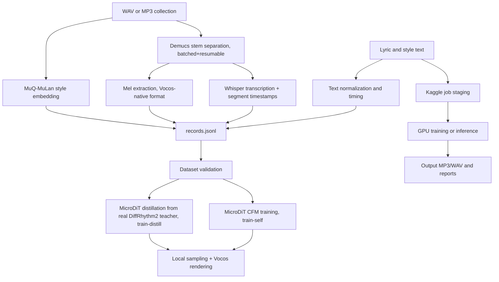

# System Architecture

GenMusic VN is a self-authored text-to-music diffusion project. The local path can
train and sample a model directly; Kaggle is an optional execution backend for
GPU jobs and dataset preprocessing.

## Workflow

See `docs/PROJECT_REPORT.md` for the full writeup (Related Work / Architecture /
Experiments / Conclusion) and `docs/experiments/*.md` for the specific bugs
found and fixed in this pipeline (vocoder distortion, non-functional
distillation, a Kaggle-GPU-quota-burning import bug). `docs/guides/run_full_pipeline.md`
has practical run instructions.

## Source Mapping

- `src/data/vietnamese_text.py`: lyric normalization.
- `src/data/vietnamese_g2p.py`: Vietnamese grapheme-to-phoneme conversion.
- `src/data/lyric_alignment.py`: lyric timing and LRC helpers.
- `src/data/preprocess_raw_vietnamese.py`: recursive audio discovery, Demucs
  separation, Whisper transcription, and Mel tensor export.
- `src/models/text_to_music_diffusion.py`: shared config, mel/waveform
  conversion, and checkpoint I/O.
- `src/models/dit_transformer.py`: MicroDiT backbone with text and
  audio-style conditioning (the only model architecture).
- `src/models/cfm_flow.py`: Conditional Flow Matching loss and Euler sampling.
- `src/training/self_diffusion.py`: dataset contract, validation, and local
  training loop.
- `src/training/distill_training.py`: optional teacher-to-MicroDiT distillation.
- `src/integrations/kaggle_auto.py`: Kaggle dataset/job staging and refresh.
- `src/evaluation/`: objective audio metrics and project plots.
- `cli.py`: command-line entry point.
- `server.py`: small standard-library HTTP backend for the web demo.

## Dataset Contract

Each dataset contains `config.json`, `records.jsonl`, and mel tensors. Legacy
records may provide one `mel_path`; current records provide `vocal_mel_path`,
`backing_mel_path`, and `style_embed_path` (the precomputed MuQ-MuLan
embedding). Validation checks every required tensor before training so a
missing stem cannot fail later inside a DataLoader. Mel tensors match Vocos's
own native format exactly (100 mels, 24kHz, n_fft=1024, hop=256) — see
`docs/experiments/vocoder_fix.md`.

When Demucs is unavailable, preprocessing keeps a fallback for compatibility,
but records it explicitly (`has_vocal: false`, `vocal_source`) and reports
partial processing as `completed_with_warnings` rather than silently degrading.
