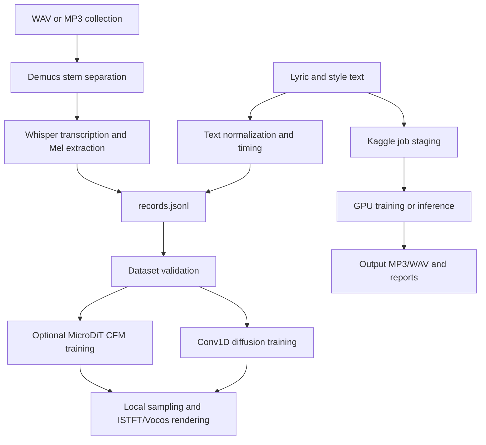

# System Architecture

GenMusic VN is a self-authored text-to-music diffusion project. The local path can
train and sample a model directly; Kaggle is an optional execution backend for
GPU jobs and dataset preprocessing.

## Workflow

## Source Mapping

- `src/data/vietnamese_text.py`: lyric normalization.
- `src/data/vietnamese_g2p.py`: Vietnamese grapheme-to-phoneme conversion.
- `src/data/lyric_alignment.py`: lyric timing and LRC helpers.
- `src/data/preprocess_raw_vietnamese.py`: recursive audio discovery, Demucs
  separation, Whisper transcription, and Mel tensor export.
- `src/models/text_to_music_diffusion.py`: configuration, text conditioning,
  Conv1D denoiser, sampling, and audio rendering.
- `src/models/dit_transformer.py`: optional MicroDiT backbone with text and
  audio-style conditioning.
- `src/models/cfm_flow.py`: Conditional Flow Matching loss and Euler sampling.
- `src/training/self_diffusion.py`: dataset contract, validation, and local
  training loop.
- `src/training/distill_training.py`: optional teacher-to-MicroDiT distillation.
- `src/integrations/kaggle_auto.py`: Kaggle dataset/job staging and refresh.
- `src/evaluation/`: objective audio metrics and project plots.
- `cli.py`: command-line entry point.
- `server.py`: small standard-library HTTP backend for the web demo.

## Dataset Contract

Each dataset contains `config.json`, `records.jsonl`, and Mel tensors. Legacy
records may provide one `mel_path`; separated records provide both
`vocal_mel_path` and `backing_mel_path`. Validation checks every required tensor
before training so a missing vocal stem cannot fail later inside a DataLoader.

When Demucs is unavailable, preprocessing keeps the existing zero-vocal fallback
for compatibility, but records it explicitly with `has_vocal: false` and reports
partial processing as `completed_with_warnings`.
