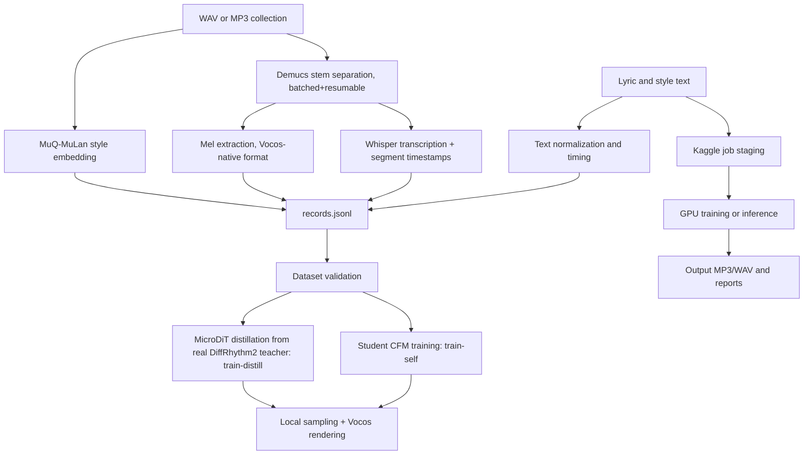
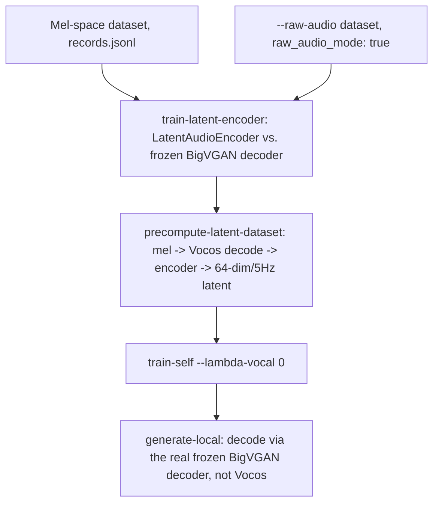

# Architecture

The research path studies Vietnamese lyric-conditioned generation via
Conditional Flow Matching (CFM), using one `MicroDiT` student over raw mel or
a compressed 64-channel/5 Hz latent space.

The current web and default `cli.py generate` route use
`native-waveform-v80` as a separate serving fallback because it produces more
intelligible demo audio. V80 is not CFM, MicroDiT, or knowledge distillation.
This runtime boundary is intentional. Personal experiment notes are kept
outside the submission tree.

## Runtime boundary

| Surface | Default backend | Purpose |
|---|---|---|
| `server.py` / web | V80 native waveform | Stable 16-second MP3 demo |
| `cli.py generate` | V80 native waveform | Kaggle serving request |
| `cli.py generate --backend cfm-research` | CFM Kaggle staging | Research reproduction |
| `cli.py generate-local` | MicroDiT/CFM checkpoint | Local research inference |

The serving result must never be used as evidence that the report's diffusion
model passed a quality gate. Conversely, a negative diffusion experiment does
not invalidate the separately measured V80 baseline.

## Workflow

```mermaid
flowchart TD
    A[Lyric and style text] --> B[Text normalization and timing]
    C[WAV or MP3 collection] --> D[Demucs stem separation, batched+resumable]
    C --> S[MuQ-MuLan style embedding]
    D --> E[Whisper transcription + segment timestamps]
    D --> M2[Mel extraction, Vocos-native format]
    B --> F[records.jsonl]
    E --> F
    M2 --> F
    S --> F
    F --> G[Dataset validation]
    G --> I[Student CFM training: train-self]
    G --> DI[MicroDiT distillation from real DiffRhythm2 teacher: train-distill]
    I --> J[Local sampling + Vocos rendering]
    DI --> J
    A --> K[Kaggle job staging]
    K --> L[GPU training or inference]
    L --> M[Output MP3/WAV and reports]
```

**Native latent path** (an alternative to raw mel — see "Native latent
backbone" below):

```mermaid
flowchart TD
    F2[Mel-space dataset, records.jsonl] --> N[train-latent-encoder: LatentAudioEncoder vs. frozen BigVGAN decoder]
    F3[--raw-audio dataset, raw_audio_mode: true] --> N
    N --> O[precompute-latent-dataset: mel -> Vocos decode -> encoder -> 64-dim/5Hz latent]
    O --> P[train-self --lambda-vocal 0]
    P --> Q[generate-local: decode via the real frozen BigVGAN decoder, not Vocos]
```

## Source Mapping

- `src/data/vietnamese_text.py` — lyric normalization.
- `src/data/lyric_alignment.py` — lyric timing and LRC helpers.
- `src/data/preprocess_raw_vietnamese.py` — recursive audio discovery, Demucs
  separation, Whisper transcription, Mel tensor export.
  The report-aligned default requires a finite 512-d MuQ-MuLan anchor and
  fails fast when that model is unavailable; zero style is debug-only.
- `src/data/precompute_latent_dataset.py` — converts an existing mel-space
  dataset into a latent-space one (64-dim/5Hz) using a trained
  `LatentAudioEncoder` checkpoint.
- `src/models/text_to_music_diffusion.py` — `MusicDiffusionConfig` (including
  `latent_mode`), mel/waveform conversion, `reconstruct_full_mix`, checkpoint
  I/O.
- `src/models/dit_transformer.py` — `MicroDiT`, the sole student backbone.
- `src/models/latent_codec.py` — `LatentAudioEncoder`, `load_frozen_decoder`,
  `multi_scale_mel_loss`.
- `src/models/cfm_flow.py` — the CFM loss (`cfm_loss`) and Euler sampler
  (`sample_cfm`).
- `src/training/self_diffusion.py` — dataset contract, train/validation
  split, early-stopping, the `train-self` training loop.
- `src/training/latent_encoder_training.py` — pretrains `LatentAudioEncoder`
  against the frozen decoder.
- `src/training/distill_training.py` — `train-distill`'s teacher-matching
  loss. Latent-mode only: `KnowledgeDistillationTrainer.__init__` raises
  immediately if `config.latent_mode` is not `True` — the earlier mel-space
  branch (a 64↔100 channel adapter plus a 93.75Hz↔5Hz time resample around
  the teacher call) was removed rather than kept as a silent fallback.
- `src/integrations/kaggle_auto.py` — Kaggle dataset/job staging.
- `src/evaluation/` — objective audio metrics and report plots.
- `cli.py` — command-line entry point.
- `server.py` — small standard-library HTTP backend for the web demo.

## Dataset contract

Each dataset directory has `config.json`, `records.jsonl`, and tensors under
`mels/`. Current records provide `vocal_mel_path`, `backing_mel_path`, and
`style_embed_path` (a precomputed 512-dim MuQ-MuLan embedding). In a
mel-space dataset, `vocal_mel_path`/`backing_mel_path` hold Vocos-native mel
tensors (100 mels, 24kHz, n_fft=1024, hop=256 — see
`docs/data_preparation.md` and §"Mel and vocoder" below for why this exact
format matters). In a latent-space dataset (`config.json`'s `latent_mode:
true`, produced by `precompute-latent-dataset`), the same path instead holds
a 64-dim/5Hz latent tensor, and `backing_mel_path` is unused (the full mix is
already baked into the one latent).

## Student backbone: MicroDiT

`MicroDiT` (`src/models/dit_transformer.py`) predicts the CFM velocity field
for a noisy audio sequence (mel or, in `latent_mode`, the native latent),
conditioned on lyrics (cross-attention) and style (additive). Default size
`dim=256, depth=4, heads=4`; configurable via `--dim`/`--depth`/`--heads`/
`--ff-mult`. `MicroDiT` reads its audio-feature width from
`config.n_mels` (100 for mel-space, 64 for `latent_mode`) — the same class
and CLI flags cover both feature spaces, no separate backbone needed.

**Lyric conditioning — cross-attention, not concatenation.** Text is encoded
by `PretrainedPhonemeEncoder`: `text2phonemesequence` G2P's each lyric string
into IPA-style phonemes (Vietnamese-aware — this is the step that gives the
model any real notion of Vietnamese pronunciation/tone), then a **frozen**
`vinai/xphonebert-base` transformer encodes the phoneme sequence, followed by
a small trainable 2-layer projection to `dim`, and then **one trainable
`TextSelfAttentionLayer`** (a Llama-style self-attention + FFN block, masking
lyric padding) that refines the frozen+projected embedding for this specific
task before it's ever read by the audio side. This exists because
XPhoneBERT's own self-attention was learned for general phoneme/prosody
prediction, not singing conditioning, and is permanently frozen — the extra
trainable layer gives the model a small amount of task-adapted lyric context
without re-learning phoneme understanding from scratch on a ~250-song budget
(the mistake the retired `NativeDiTStudent` backbone made, see below). Each
`CrossAttentionDecoderLayer` in the backbone then keeps self-attention
restricted to the audio sequence alone (so rotary positions and the
attention mask are just plain frame positions), and adds a dedicated
`nn.MultiheadAttention` sublayer where audio queries attend to the refined
text keys/values. This replaced an earlier "prepend"-style design (text and
audio tokens sharing one self-attention sequence) after SongGen
(arXiv:2502.13128) reported cross-attention lyric conditioning clearly
beating that (FAD 1.73 vs 3.56, PER 43.34 vs 56.21) — and after this
project's own `NativeDiTStudent` experiment independently re-confirmed the
same conclusion at matched size/epoch (see below).

**No backing-track conditioning.** `InputEmbedding` only ever sees the mel
tensor (`x_proj = proj_x(x)`, then style/time added additively) — there is no
`backing_mel` input to the model at all. This is a real, deliberate
simplification versus an earlier design that fed a per-frame backing-mel
tensor as conditioning.

**But the training *target* is still the full mix, not vocal-only.**
`cfm_loss` builds `x1` via `reconstruct_full_mix(vocal_mel, backing_mel,
config)` — summing the linear-magnitude mel energies of the (Demucs-separated)
vocal and backing stems, then re-logging — except in `latent_mode`, where
`vocal_mel_path` already holds the full-mix latent directly and no summing is
needed. So the model is trained to predict a full song's velocity field from
an *unconditioned* starting point (no backing input), while a separate
auxiliary head (`vocal_proj_out`, "Mixed Pro" from SongGen) is trained
alongside on the vocal-only velocity so the model doesn't neglect the
quieter, sparser vocal signal in favor of the louder accompaniment.

**Style conditioning** is a single 512-dim MuQ-MuLan embedding
(`AudioStyleEncoder`, a small MLP), added additively at the input embedding
and again at the final `AdaLayerNormZeroFinal`.

**REPA hook**: `MicroDiT` always constructs a `repa_head` (projects a chosen
intermediate hidden state to 1024-dim) but it's a no-op unless a caller
passes `repa_layer_idx`. In practice this is now permanently unused:
`compute_repa_target` (`src/training/repa.py`) decodes `x1` via Vocos
(mel-space-only, 100-channel) then runs it through MuQ, with no
`latent_mode` implementation, and `train-distill` requires `latent_mode=True`
unconditionally — so `KnowledgeDistillationTrainer.__init__` raises if
`beta_repa > 0.0` is passed at all, rather than let the mismatch surface as a
silently-caught exception inside `compute_repa_target` (which would otherwise
print a warning and return `None` every step, making `beta_repa` a silent
no-op). Not currently used by `train-self` either.

## A retired second backbone: `NativeDiTStudent`

Earlier revisions of this project also had a second backbone,
`NativeDiTStudent` (`src/models/diffrhythm2_native.py`, selected via
`--architecture native_dit`) — a vendored (Apache 2.0, attributed) port of
DiffRhythm2's *own* backbone shape: text and audio shared **one concatenated
self-attention sequence** instead of cross-attention, and lyrics were
embedded by a **from-scratch-trained** `nn.Embedding` rather than frozen
XPhoneBERT. It was used for the first positive latent-space listening result
(prior measurements) and the mel-vs-latent comparison in
the report's Experiments chapter.

It has since been merged/retired, based on evidence gathered across several
sessions:
- At matched size/epoch, the concatenated-self-attention design did not
  improve ground-truth CFM loss over `MicroDiT`'s cross-attention, while
  being **~4.4x slower** per step — `MicroDiT`'s narrower self-attention
  (audio-only, no padding) can use a faster fused attention kernel, whereas
  the concatenated design must pass an explicit dense padding mask into
  attention, which forces a slower fallback kernel on top of the strictly
  larger $O((L{+}T)^2)$ attention cost (prior measurements).
- Training a lyric embedding table from scratch throws away XPhoneBERT's
  pretrained phonetic/tonal knowledge for no measured benefit, and is a
  needless overfitting risk on a ~250-song budget.
- `train-distill` never supported `native_dit` at all — folding everything
  into one backbone means every training path (`train-self`, `train-distill`)
  and both feature spaces (mel, `latent_mode`) now share the same model
  class.

`MicroDiT`'s cross-attention design already reads `config.n_mels` generically
and needed no changes to run in `latent_mode` — the only genuinely new
addition from the `NativeDiTStudent` experiment is the `TextSelfAttentionLayer`
described above. Historical results attributed to `NativeDiTStudent` in
prior measurements and the report remain accurate accounts of what was
actually run at the time; they describe a backbone that no longer exists in
the current codebase.

## Native latent backbone and encoder (`latent_mode`)

The teacher (DiffRhythm2) does not operate on mel-spectrograms: it runs on
**64-dimensional latents from its own Music VAE, at 5 Hz** — a ~19x lower
frame rate than the student's usual 100-dim/93.75Hz raw mel. Giving the
student that same compressed space (rather than only resampling the
*teacher-query* side during distillation, see below) needed two new pieces:

- **`LatentAudioEncoder`** (`src/models/latent_codec.py`) — DiffRhythm2
  publishes its **decoder** (BigVGAN, `decoder.bin`/`decoder.json` on
  HuggingFace `ASLP-lab/DiffRhythm2`) but not its VAE encoder. Rather than
  training a full paper-faithful VAE (adversarial discriminators — too
  costly/risky for this project's data budget), this encoder is trained from
  scratch against the real, **frozen** decoder (`train-latent-encoder`).
  Architecture: `Conv1d(1→32)` stem, five `_DownsampleBlock`s (each three
  dilated residual units + a strided downsample conv) with strides
  `(10,10,8,3,2)` — product 4800, matching the paper's stated encode-side
  compression ratio — channels doubling `32→64→128→256→512` (capped at 512),
  then `Conv1d(512→128)` split into `mu`/`logvar` (64 dims each). **Real
  probabilistic bottleneck**: reparameterization trick (`z = mu +
  exp(0.5·logvar)·ε` at train time, `z = mu` at eval) plus a KL-divergence
  term against `LatentAudioEncoder` — a full-corpus collapse (§4.29) traced
  to the *absence* of this bottleneck (deterministic single-point encoding
  invites the same regression-to-the-mean pathology as the CFM loss, §4.11)
  is what motivated adding it; see §4.30 for the fix and the before/after
  numbers. Reconstruction loss (`multi_scale_mel_loss`) is unchanged: the
  unweighted average of L1-on-log-mel across three STFT scales, `(n_fft,
  n_mels) ∈ {(512,40), (1024,80), (2048,80)}`. Total loss is
  `recon_loss + kl_weight·kl_divergence_loss` (`--kl-weight`, default
  `1e-4`). **Deliberately not added**: an adversarial/discriminator term —
  the other half of a paper-faithful VAE, but GAN-training instability was
  judged not worth the risk under this project's deadline (see §4.30's own
  reasoning).
- **`precompute-latent-dataset`** and `MusicDiffusionConfig.latent_mode`
  wire an existing mel dataset into this space; `render_mel_to_wav()`
  branches on `latent_mode` to decode through the frozen BigVGAN decoder
  directly instead of Vocos.
- **`train-latent-encoder` also accepts a `--raw-audio` dataset**
  (`config.json`'s `raw_audio_mode: true`) instead of a mel dataset —
  `LatentAudioEncoder` already takes raw waveform (`Conv1d(1, ...)`), so this
  sums the already-separated `vocal_wav_path`/`backing_wav_path` tensors
  directly, skipping the mel→Vocos-decode round trip entirely (the encoder
  trains on the pristine recording, not a Vocos reconstruction of it). Also
  accepts several dataset dirs at once (like `train-self`), each optionally
  capped via `--max-records-per-dataset` before combining — used to
  smoke-test the 6-part raw corpus with 1 record from each part in a single
  run. `precompute-latent-dataset` does not yet read a `raw_audio_mode`
  dataset directly (still expects mel).

**Two independent collapse failure modes hit already, worth knowing before
retraining this encoder**:
1. At small scale (249 songs), a flat learning rate and no gradient clipping
   made the loss curve oscillate instead of converge. Fixed with LR warmup
   (`--warmup-steps`, default 200) + cosine decay + gradient-norm clipping
   (`--grad-clip-norm`, default 1.0), now the default training recipe
   (§4.24).
2. At full scale (1839 songs), the *same* warmup/clipping recipe still
   collapsed the encoder twice under different hyperparameters — the loss
   curve looked healthy but decoded ground-truth latents were still
   near-monotone/single-pitch. Root cause was architectural, not
   optimization: no probabilistic bottleneck (§4.29-4.30, fixed by the
   `mu`/`logvar`/KL addition described above).

Both manifest the same way: `pitch_std_semitones` near-zero (≈0.4-0.9) when
ground-truth latents are decoded directly (bypassing the CFM student
entirely), despite not being literal noise by spectral flatness, and despite
a normal-looking training loss curve. **Always sanity-check a retrained
encoder** this way — `scripts/check_latent_encoder_quality.py` (or its
Kaggle launcher, `scripts/run_kaggle_check_latent_encoder_quality.py`)
automates exactly this check — before trusting any downstream CFM training
run.

## Conditional Flow Matching (shared by both backbones)

`cfm_loss` (`src/models/cfm_flow.py`) implements rectified-flow training:
`x0 ~ N(0,I)`, `xt = (1-t)x0 + t·x1` for `t ~ U(0,1)`, target velocity
`x1 - x0`. On top of the base MSE, several terms are combined:

- **Frame-activity reweighting**: frames above the 55th-percentile energy
  quantile get up to 3x the loss weight of quiet frames (renormalized to
  mean 1 per sample) — prevents silence-dominated frames from swamping the
  gradient.
- **`loss_gt = velocity_loss + 0.15·reconstruction_loss + 0.05·(time_delta +
  frequency_delta)`** — `reconstruction_loss` is L1 between the one-step
  reconstructed clean sample and `x1`; the delta terms are L1 on the
  first-difference along time/mel-bin axes. This combination (added to fight
  a real regression-to-the-mean/"distributional averaging" failure mode —
  see prior measurements) is what most directly determines
  output diversity; changing these weights changes the collapse/diversity
  trade-off directly.
- **Vocal-auxiliary loss** (`--lambda-vocal`, default 1.0, `train-distill`
  only): same recipe against the vocal-only velocity target, using the
  model's second output head. Structurally disabled in `latent_mode`
  (mandatory for `train-distill`) regardless of this flag's value: only one
  full-mix latent per record is precomputed, no separate vocal-only latent
  target exists for the head to regress against, so `train_epoch` never
  computes this loss. The parameter is kept only so existing callers passing
  `lambda_vocal=1.0` (the old mel-space default) keep working unchanged.
- **Lyric-content-sensitivity terms** (`train_model`'s own defaults:
  `text_contrastive_weight=0.08`, `text_sensitivity_weight=2.0` — these are
  *disabled* at `cfm_loss`'s own function-signature level and only enabled by
  `train_model`): builds a batch of mismatched lyrics (`build_mismatched_texts`,
  rotates each sample to a different sample's non-empty lyric), and penalizes
  the model if swapping the lyric doesn't change its prediction enough — a
  contrastive hinge (matched error should be lower than mismatched error by
  at least a margin) plus a sensitivity floor (relative response to a lyric
  swap should exceed `text_sensitivity_target=0.20`). This is also the gate
  used to decide whether a checkpoint counts as "the best one" during
  training (see below) — a checkpoint with good validation loss but a model
  that ignores lyrics entirely does not pass the gate.

Sampling (`sample_cfm`) is fixed-step Euler integration (default `--steps
32`), with optional classifier-free guidance (`--guidance-scale`, an extra
unconditional forward pass extrapolated against the conditional one).

## Training loop, validation, and early stopping (`train-self`)

`src/training/self_diffusion.py`'s `train_model()` drives `MicroDiT` in
either feature space identically — same loss, same
optimizer/scheduler/EMA, same early-stopping machinery.

- **Song-level train/validation split** (`split_training_records`): each
  record is assigned to train or validation by a deterministic hash of
  `f"{seed}:{record_id}"` — stable across resumes, no random-module state to
  lose. Default `validation_fraction=0.05`, capped at
  `validation_max_records=128`.
- **Checkpoint-improvement gate** (`_is_checkpoint_improvement`): a
  checkpoint only counts as "best" if validation CFM loss improves by more
  than `early_stopping_min_delta` (0.001) **and** the lyric-sensitivity
  metric (`evaluate_text_sensitivity`, EMA-weighted) is at or above a floor
  (default `0.90 * text_sensitivity_target`). A model that improves
  validation loss by becoming *less* responsive to its lyric input does not
  pass.
- **Early stopping**: triggers once `completed_epochs >= minimum_epochs`
  (default 8) **and** `epochs_without_improvement >= early_stopping_patience`
  (default 4) — i.e. training runs until the validation-gated checkpoint
  metric plateaus, not a fixed epoch count (pass a large `--epochs` cap and
  let this decide).
- **LR schedule**: linear warmup over 5% of total steps, then cosine decay to
  10% of peak LR. **EMA**: decay 0.999, used for both validation evaluation
  and the saved checkpoint. **Mixed precision**: autocast fp16 + GradScaler
  on CUDA; gradient clipping fixed at norm 1.0.
- Several of the hyperparameters above (`style_dropout_prob`,
  `text_dropout_prob`, `text_contrastive_*`, `text_sensitivity_*`,
  `validation_*`, `early_stopping_*`) are `train_model()`-level Python
  defaults, not currently exposed as `cli.py train-self` flags — change them
  by calling `train_model()` directly if you need something other than the
  defaults above.

## Distillation (`train-distill`)

`src/training/distill_training.py` replicates DiffRhythm2's real teacher call
contract — `KnowledgeDistillationTrainer` always instantiates a `MicroDiT`
student, **latent-mode only** (`config.latent_mode` must be `True`,
`config.n_mels` must equal the teacher's own native latent width — both
checked at construction; `run_distillation_training` raises `ValueError`
immediately on a mismatch, never falls back).

- **No teacher-rate or channel bridging code exists anymore.** An earlier
  mel-space branch resampled between the student's 93.75Hz mel rate and the
  teacher's native 5Hz (`_resample_time_dimension`) and bridged 100↔64 mel
  bins (`_resize_mel_bins`, plus a trainable `from_teacher_mel: Linear(64,100)`
  adapter) around the teacher call. Since `latent_mode` is now mandatory,
  teacher and student always already share the exact same 64-dim/5Hz
  representation, so this whole bridge — dead weight that could only ever
  run in the now-unsupported mel-space path — was deleted outright rather
  than kept behind an `if latent_mode` branch. `_teacher_velocity` calls the
  teacher directly on the student's own `(xt, x1)` tensors, no resampling, no
  adapter. `_build_block_attn_mask` still replicates the teacher's
  block-autoregressive attention pattern over a `[Text, Clean, Noisy]` layout
  (clean context attends causally by block; noisy queries attend only to
  strictly-earlier clean blocks and their own block's noisy frames).
- **`x1` construction, and the bug this fixed**: `x1` is simply the
  precomputed record's latent (`vocal_mel_path` in `latent_mode` already
  holds the full-mix latent from `precompute-latent-dataset`, summed and
  encoded once, upstream of training — see `docs/data_preparation.md`). An
  earlier version of `train_epoch` still ran this through
  `reconstruct_full_mix` (the mel-space log-energy-sum formula) against a
  zero-tensor `backing_mel` placeholder (latent-mode records have no real
  `backing_mel_path`) — silently forcing the real training target
  strictly positive and roughly halving its variance relative to the true
  encoder output (confirmed on real data: true latent std 0.934, 53.4%
  negative values; corrupted target std 0.462, 0% negative). This produced a
  target with less information than the encoder actually output, quite
  possibly contributing to (or fully explaining) the near-total output
  collapse observed on the 15-epoch checkpoint described in the report. Fixed
  by using the precomputed latent directly, with no `reconstruct_full_mix`
  call anywhere in the `train-distill` path.
- **Mixed loss**: `loss = (1 - alpha_feature)·loss_velocity + alpha_feature·loss_gt`
  if the teacher loaded, else `loss_gt` alone (forced `alpha_feature=1.0`).
  `loss_velocity` is **L1** (not MSE — chosen to avoid MSE's tendency toward
  blurry/averaged predictions, per Dieleman 2024 and DMD/ADM). Default
  `alpha_feature=0.5`; prior measurements found `≈0.8` to be a
  real, multi-song-verified optimum, not noise. Vocal-aux loss (`lambda_vocal`)
  and REPA loss (`beta_repa`) are both structurally inert/rejected now (see
  above and the REPA hook note) — the mixed loss above is the whole story in
  practice.
- **Honest fallback, no silent teacher**: if the real teacher or its lyric
  tokenizer can't be loaded (no internet, DiffRhythm2 repo not on
  `PYTHONPATH`), `train-distill` raises immediately rather than silently
  training ground-truth-only under the distillation name. Use `train-self`
  for that.
- **Note on stale prior documentation**: an earlier iteration of this
  project's history describes a `beta_attention` (attention-matrix
  distillation) loss term. It does not exist in the current file — only
  `alpha_feature`, `lambda_vocal`, and `beta_repa` are real loss-weight knobs
  today (and the latter two are now inert/rejected, see above). Treat
  prior measurements as a historical record of a design that was
  implemented and later removed/superseded, not as a description of current
  behavior.

## Mel and vocoder

Mel tensors match Vocos's own native feature extractor exactly
(`charactr/vocos-mel-24khz`: 100 mels, 24kHz, n_fft=1024, hop=256, magnitude
mel with `power=1`, natural log with a `1e-7` floor, no upper clip) — see
`compute_mel_spectrogram()` in `src/models/text_to_music_diffusion.py`. This
specific match matters a lot in practice: an earlier 64-mel/16kHz/log-power
convention was the root cause of severely distorted generated audio (fixed,
verified to restore >0.99 log-mel correlation on real audio — see
prior measurements). `--vocoder vocos` (default) decodes the mel
unmodified; `griffinlim` (64 iterations) is the fallback if Vocos is
unavailable or the config doesn't match. In `latent_mode`, neither is used —
`render_mel_to_wav` decodes through the real frozen BigVGAN decoder instead.

## Checkpoints

`save_checkpoint` excludes frozen, re-downloadable weights (XPhoneBERT) from
the saved file — a checkpoint is the trainable weights plus enough metadata
(`roberta_model`, `dim`/`depth`/`heads`/`ff_mult`, mel config) to reconstruct
the exact model on load. This keeps checkpoints around 50-100MB instead of
>1GB. Checkpoints saved before the `NativeDiTStudent` retirement may carry an
`"architecture": "native_dit"` key in their `arch` metadata; this key is no
longer read by `load_checkpoint` (always instantiates `MicroDiT` now), so
loading such a checkpoint today will load few or none of its weights
correctly — expected, not a bug, since that backbone no longer exists.

## Important evaluation boundary

Random/synthetic mel data can verify tensor shapes, optimization, checkpoint
loading, and audio rendering. It cannot demonstrate natural singing,
Vietnamese intelligibility, or musical quality — those claims require real
audio with valid vocal stems and lyric metadata, and, even then, a human
listening to the output. Automated sanity stats (peak amplitude, RMS,
silence ratio, spectral flatness, voiced ratio, pitch-std) catch crashes and
some classes of degenerate output; they are not a substitute for listening,
and prior measurements record more than one case where a metric
looked good while the audio still sounded wrong (or vice versa).
