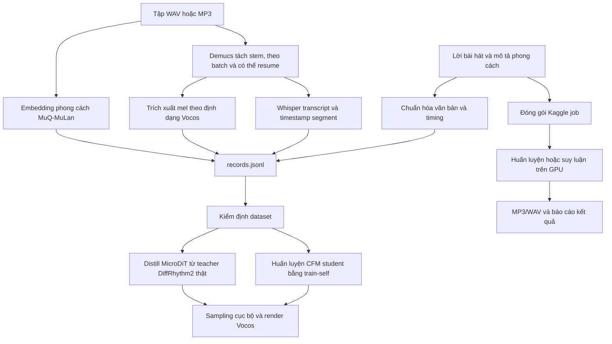
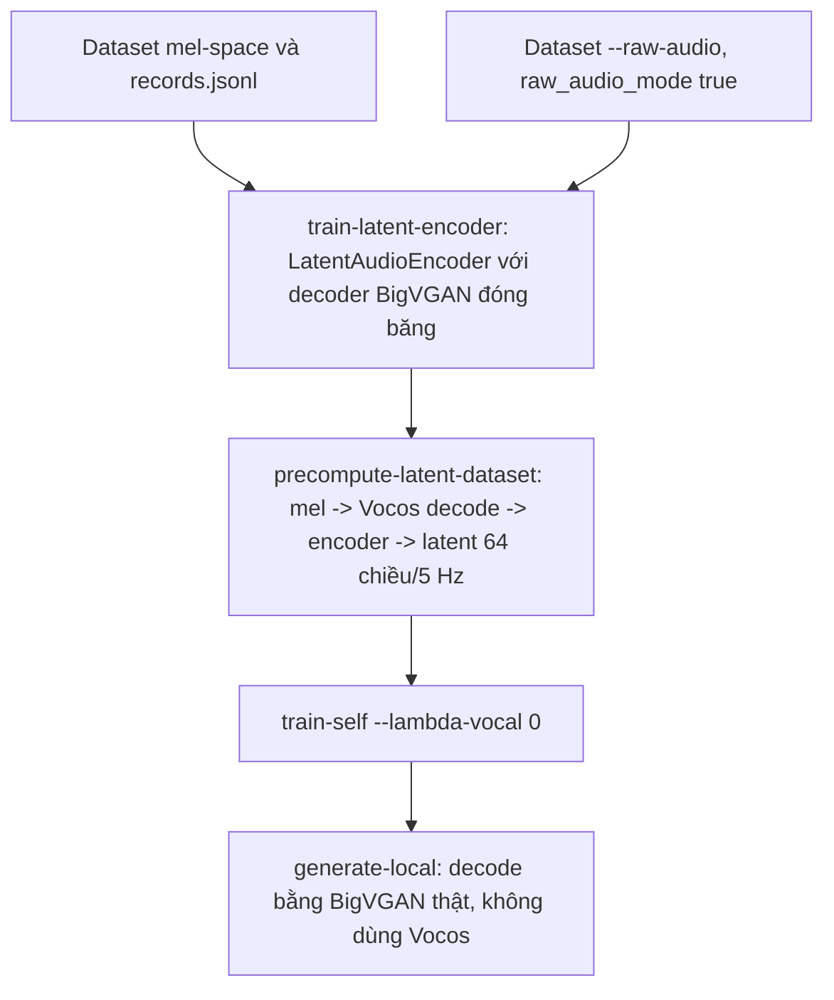

# Kiến trúc

> Bản Việt hóa của `docs/architecture.md`. Các tên lớp, hàm, option, tensor
> và thuật ngữ kỹ thuật được giữ nguyên để đối chiếu trực tiếp với mã nguồn.
> Khi có khác biệt, tài liệu gốc là nguồn chuẩn.

Luồng nghiên cứu khảo sát việc sinh nhạc có điều kiện theo lời tiếng Việt bằng
Conditional Flow Matching (CFM), dùng một student `MicroDiT` trên mel thô hoặc
không gian latent nén 64 kênh/5 Hz.

Web app và lệnh `cli.py generate` mặc định hiện dùng
`native-waveform-v80` như một serving fallback tách biệt vì cho audio demo dễ
nghe lời hơn. V80 không phải CFM, MicroDiT hay knowledge distillation. Ranh
giới runtime này là chủ đích; ghi chú thí nghiệm cá nhân nằm ngoài cây nộp.

## Ranh giới runtime

| Bề mặt | Backend mặc định | Mục đích |
|---|---|---|
| `server.py` / web | V80 native waveform | Demo MP3 ổn định dài 16 giây |
| `cli.py generate` | V80 native waveform | Gửi yêu cầu serving lên Kaggle |
| `cli.py generate --backend cfm-research` | CFM Kaggle staging | Tái lập nghiên cứu |
| `cli.py generate-local` | Checkpoint MicroDiT/CFM | Suy luận nghiên cứu cục bộ |

Không được dùng kết quả serving làm bằng chứng rằng diffusion model trong báo
cáo đã vượt quality gate. Ngược lại, một thí nghiệm diffusion âm tính không
phủ nhận baseline V80 đã được đo riêng.

## Quy trình

**Luồng native latent**, thay thế cho mel thô:

## Ánh xạ mã nguồn

- `src/data/vietnamese_text.py` — chuẩn hóa lời.
- `src/data/lyric_alignment.py` — timing lời và helper LRC.
- `src/data/preprocess_raw_vietnamese.py` — tìm audio đệ quy, tách Demucs,
  transcript Whisper và xuất tensor mel. Mặc định theo báo cáo bắt buộc có
  MuQ-MuLan anchor 512 chiều hữu hạn; zero-style chỉ dùng debug.
- `src/data/precompute_latent_dataset.py` — chuyển dataset mel sang latent 64
  chiều/5 Hz bằng checkpoint `LatentAudioEncoder`.
- `src/models/text_to_music_diffusion.py` — `MusicDiffusionConfig`, chuyển
  mel/waveform, `reconstruct_full_mix` và I/O checkpoint.
- `src/models/dit_transformer.py` — `MicroDiT`, backbone student duy nhất.
- `src/models/latent_codec.py` — `LatentAudioEncoder`,
  `load_frozen_decoder`, `multi_scale_mel_loss`.
- `src/models/cfm_flow.py` — CFM loss (`cfm_loss`) và Euler sampler
  (`sample_cfm`).
- `src/training/self_diffusion.py` — hợp đồng dataset, train/validation split,
  early stopping và vòng lặp `train-self`.
- `src/training/latent_encoder_training.py` — pretrain
  `LatentAudioEncoder` với decoder đóng băng.
- `src/training/distill_training.py` — loss teacher-matching của
  `train-distill`. Chỉ hỗ trợ latent-mode; constructor lỗi ngay nếu
  `config.latent_mode` không phải `True`. Nhánh mel-space 64↔100 kênh và
  resample thời gian 93,75 Hz↔5 Hz đã được xóa.
- `src/integrations/kaggle_auto.py` — đóng gói dataset/job Kaggle.
- `src/evaluation/` — metric audio và biểu đồ báo cáo.
- `cli.py` — entry point dòng lệnh.
- `server.py` — HTTP backend nhỏ cho web demo.

## Hợp đồng dataset

Mỗi thư mục dataset có `config.json`, `records.jsonl` và tensor trong `mels/`.
Record hiện tại cung cấp `vocal_mel_path`, `backing_mel_path` và
`style_embed_path` chứa embedding MuQ-MuLan 512 chiều.

Trong mel-space, hai đường dẫn audio chứa mel đúng định dạng Vocos: 100 mel,
24 kHz, n_fft=1024, hop=256. Trong latent-space (`latent_mode: true`), cùng
đường dẫn đó chứa latent 64 chiều/5 Hz; `backing_mel_path` không dùng vì full
mix đã nằm trong một latent duy nhất.

## Backbone student: MicroDiT

`MicroDiT` dự đoán trường vận tốc CFM cho chuỗi audio nhiễu, ở mel hoặc native
latent, với điều kiện là lời qua cross-attention và style cộng vào hidden.
Kích thước mặc định là `dim=256, depth=4, heads=4`, cấu hình bằng `--dim`,
`--depth`, `--heads`, `--ff-mult`. Độ rộng audio lấy từ `config.n_mels`: 100
cho mel-space và 64 cho latent-mode; không cần backbone riêng.

### Conditioning lời bằng cross-attention

`PretrainedPhonemeEncoder` gọi `text2phonemesequence` để G2P lời thành phoneme
kiểu IPA có hỗ trợ tiếng Việt, rồi transformer **đóng băng**
`vinai/xphonebert-base` encode chuỗi này. Một projection hai lớp có thể train
đưa đặc trưng về `dim`, sau đó một `TextSelfAttentionLayer` có thể train tinh
chỉnh context lời cho nhiệm vụ hát trước khi audio đọc nó.

Lớp bổ sung cần thiết vì self-attention gốc của XPhoneBERT học dự đoán
phoneme/prosody tổng quát và bị đóng băng. Nó cung cấp ít khả năng thích nghi
theo tác vụ mà không phải học lại hiểu biết phonetic từ đầu trên khoảng 250
bài. Mỗi `CrossAttentionDecoderLayer` giữ self-attention chỉ trên audio và có
`nn.MultiheadAttention` riêng để audio query tham dự text key/value.

Thiết kế này thay mô hình prepend text/audio vào cùng một chuỗi. SongGen báo
cáo cross-attention tốt hơn prepend rõ rệt (FAD 1,73 so với 3,56; PER 43,34 so
với 56,21), và thí nghiệm `NativeDiTStudent` của dự án xác nhận cùng kết luận.

### Backing, target và style

Không có backing-track conditioning: `InputEmbedding` chỉ nhận tensor mel rồi
cộng style/time. Đây là giản lược có chủ đích so với thiết kế cũ truyền
backing-mel theo từng frame.

Tuy vậy, **target vẫn là full mix**. `cfm_loss` gọi
`reconstruct_full_mix(vocal_mel, backing_mel, config)`, cộng năng lượng mel
tuyến tính rồi lấy log. Trong latent-mode, `vocal_mel_path` đã là full-mix
latent nên không cần cộng. Một head phụ `vocal_proj_out` học vận tốc vocal-only
để model không bỏ qua tín hiệu vocal nhỏ và thưa hơn backing.

Style là một embedding MuQ-MuLan 512 chiều qua MLP `AudioStyleEncoder`, được
cộng ở input embedding và `AdaLayerNormZeroFinal` cuối.

### REPA hook

`MicroDiT` luôn có `repa_head` chiếu hidden trung gian sang 1024 chiều, nhưng
không làm gì nếu caller không truyền `repa_layer_idx`. Hiện REPA không dùng:
`compute_repa_target` chỉ hỗ trợ mel-space/Vocos trong khi `train-distill` bắt
buộc latent-mode. Constructor vì vậy từ chối `beta_repa > 0.0` thay vì để nó
âm thầm thành no-op. `train-self` cũng không dùng hook này.

## Backbone thứ hai đã loại bỏ: `NativeDiTStudent`

Các revision cũ từng có `NativeDiTStudent`, một port có ghi công từ kiến trúc
DiffRhythm2: text và audio dùng chung một self-attention sequence nối lại, còn
lyric embedding là `nn.Embedding` học từ đầu. Nó từng cho kết quả nghe latent
đầu tiên và được dùng trong so sánh mel/latent của báo cáo, nhưng sau đó bị
gộp và loại bỏ dựa trên bằng chứng:

- Ở cùng kích thước và số epoch, concatenated self-attention không giảm CFM
  loss tốt hơn cross-attention nhưng chậm khoảng 4,4 lần. MicroDiT dùng
  self-attention audio-only hẹp hơn và kernel fused nhanh; thiết kế nối chuỗi
  cần padding mask dày và có chi phí $O((L+T)^2)$.
- Học lyric embedding từ đầu bỏ kiến thức phonetic/thanh điệu của XPhoneBERT,
  tăng rủi ro overfit mà không có lợi ích đo được.
- `train-distill` chưa từng hỗ trợ `native_dit`. Một backbone duy nhất giúp mọi
  đường train và cả hai feature space dùng chung model class.

`MicroDiT` vốn đã đọc `config.n_mels` tổng quát. Phần hữu ích duy nhất giữ lại
từ thí nghiệm kia là `TextSelfAttentionLayer`. Checkpoint cũ có metadata
`architecture: native_dit` không còn tải đúng vào code hiện tại.

## Native latent backbone và encoder (`latent_mode`)

DiffRhythm2 hoạt động trên latent Music VAE 64 chiều ở 5 Hz, thấp hơn khoảng 19
lần so với mel 100 chiều/93,75 Hz. Đưa student vào cùng không gian cần:

- **`LatentAudioEncoder`**: DiffRhythm2 công bố decoder BigVGAN nhưng không có
  VAE encoder. Dự án huấn luyện encoder từ đầu với decoder thật đã đóng băng,
  tránh discriminator đối kháng vì rủi ro trên ngân sách dữ liệu nhỏ.
  Kiến trúc gồm stem `Conv1d(1→32)`, năm `_DownsampleBlock` với stride
  `(10,10,8,3,2)`, tích 4800, channel tăng `32→64→128→256→512`, rồi
  `Conv1d(512→128)` tách thành `mu` và `logvar` 64 chiều.
- **Probabilistic bottleneck thật**: lúc train dùng
  `z = mu + exp(0.5·logvar)·ε`, lúc eval dùng `z = mu`, cùng KL divergence.
  Encoder toàn corpus từng collapse vì thiếu bottleneck; deterministic
  single-point encoding khuyến khích hồi quy về trung bình giống failure mode
  CFM. Reconstruction loss là trung bình không trọng số của L1 log-mel ở ba
  STFT scale `(512,40)`, `(1024,80)`, `(2048,80)`. Tổng loss là
  `recon_loss + kl_weight·kl_divergence_loss`, mặc định `kl_weight=1e-4`.
  Không thêm adversarial loss vì độ bất ổn GAN không phù hợp deadline.
- **`precompute-latent-dataset`** và `MusicDiffusionConfig.latent_mode` nối
  dataset mel vào không gian này; `render_mel_to_wav()` decode bằng BigVGAN
  thay vì Vocos.
- **`train-latent-encoder` nhận dataset `--raw-audio`**: cộng waveform
  vocal/backing đã tách trực tiếp, bỏ vòng mel → Vocos → audio. Lệnh nhận nhiều
  dataset và `--max-records-per-dataset`; `precompute-latent-dataset` hiện vẫn
  chỉ nhận mel và một nguồn.

Hai failure mode encoder cần nhớ:

1. Ở 249 bài, learning rate phẳng và không clip gradient làm loss dao động.
   Đã sửa bằng warmup mặc định 200 bước, cosine decay và clip gradient norm
   1,0.
2. Ở 1.839 bài, cùng recipe tối ưu vẫn collapse dù loss trông khỏe. Nguyên
   nhân là kiến trúc thiếu probabilistic bottleneck, đã sửa bằng
   `mu`/`logvar`/KL.

Cả hai biểu hiện bằng `pitch_std_semitones` gần 0, khoảng 0,4–0,9, khi decode
trực tiếp latent ground truth mà bỏ qua CFM. Luôn chạy
`scripts/check_latent_encoder_quality.py` trước khi dùng encoder downstream.

## Conditional Flow Matching

`cfm_loss` cài đặt rectified-flow:

`x0 ~ N(0,I)`, `xt = (1-t)x0 + t·x1`, `t ~ U(0,1)`, target velocity là
`x1 - x0`.

Ngoài MSE cơ sở còn có:

- **Tái trọng số activity theo frame**: frame trên phân vị 55% năng lượng nhận
  tối đa 3 lần trọng số loss, sau đó chuẩn hóa mean về 1. Điều này ngăn frame
  im lặng lấn át gradient.
- **`loss_gt = velocity_loss + 0.15·reconstruction_loss + 0.05·(time_delta +
  frequency_delta)`**. Reconstruction là L1 giữa clean sample tái dựng một
  bước và `x1`; delta là L1 của sai phân bậc nhất theo trục thời gian và mel.
  Các term này chống hồi quy về trung bình và distributional averaging.
- **Vocal auxiliary loss** (`--lambda-vocal`, mặc định 1 cho
  `train-distill`) dùng cùng công thức trên target vocal-only. Nó bị vô hiệu
  cấu trúc trong latent-mode vì chỉ có full-mix latent, không có target vocal
  latent riêng.
- **Lyric-content sensitivity**: `train_model` mặc định dùng
  `text_contrastive_weight=0.08`, `text_sensitivity_weight=2.0`. Batch lyric
  mismatch được tạo bằng cách xoay lyric giữa sample; loss phạt nếu đổi lời
  không làm prediction thay đổi đủ. Có contrastive hinge và sensitivity floor
  `text_sensitivity_target=0.20`. Đây cũng là gate chọn best checkpoint.

`sample_cfm` tích phân Euler số bước cố định, mặc định 32, và tùy chọn
classifier-free guidance bằng một forward unconditional bổ sung.

## Vòng lặp train, validation và early stopping

`train_model()` điều khiển `MicroDiT` giống nhau ở cả hai feature space:

- **Song-level split**: `split_training_records` dùng hash xác định của
  `f"{seed}:{record_id}"`; ổn định khi resume. Validation mặc định 5%, tối đa
  128 record.
- **Gate cải thiện checkpoint**: validation CFM loss phải tốt hơn ít nhất
  `early_stopping_min_delta=0.001` và lyric sensitivity EMA phải đạt tối thiểu
  90% target. Model giảm loss bằng cách bỏ qua lyric không được xem là tốt hơn.
- **Early stopping**: sau ít nhất 8 epoch và 4 epoch không cải thiện. Nên truyền
  trần epoch lớn để gate quyết định dừng.
- **Scheduler**: warmup tuyến tính 5% tổng step, cosine decay về 10% peak LR.
  EMA decay 0,999 dùng cho validation và checkpoint. CUDA dùng autocast fp16,
  GradScaler và clip gradient norm 1,0.
- Nhiều tham số dropout, contrastive, sensitivity, validation và early stop là
  mặc định Python của `train_model()`, chưa có flag CLI; muốn đổi phải gọi hàm
  trực tiếp.

## Distillation (`train-distill`)

`KnowledgeDistillationTrainer` tái lập contract teacher DiffRhythm2, luôn dùng
student `MicroDiT` và chỉ nhận latent-mode. `config.n_mels` phải bằng độ rộng
latent native của teacher.

- Không còn bridge tốc độ hay channel. Nhánh cũ resample 93,75 Hz↔5 Hz và
  chiếu 100↔64 kênh đã xóa vì student/teacher giờ cùng representation.
  `_teacher_velocity` gọi teacher trực tiếp trên `(xt, x1)`.
  `_build_block_attn_mask` vẫn tái lập attention block-autoregressive trên
  layout `[Text, Clean, Noisy]`.
- `x1` là latent full mix đã precompute. Bản cũ từng gọi nhầm
  `reconstruct_full_mix` với backing zero, làm target buộc dương và giảm gần
  nửa variance: latent thật std 0,934 với 53,4% giá trị âm; target lỗi std
  0,462 và 0% âm. Hiện latent được dùng trực tiếp.
- Loss trộn:
  `loss = (1-alpha_feature)·loss_velocity + alpha_feature·loss_gt` khi có
  teacher, ngược lại chỉ `loss_gt`. `loss_velocity` dùng L1 để giảm xu hướng
  dự đoán mờ/trung bình. Mặc định code là 0,5 nhưng đo lường nhiều bài cho thấy
  `alpha_feature≈0.8` tốt hơn. Vocal-aux và REPA hiện không hoạt động trong
  latent distillation.
- Nếu không tải được teacher hay tokenizer, lệnh lỗi ngay; không âm thầm giả
  distillation. Dùng `train-self` cho ground-truth-only.
- Tài liệu lịch sử từng nói đến `beta_attention`, nhưng term này không còn
  trong code. Hiện chỉ có `alpha_feature`, `lambda_vocal`, `beta_repa`, trong
  đó hai tham số sau vô hiệu hoặc bị từ chối ở latent-mode.

## Mel và vocoder

Tensor mel khớp bộ trích xuất native của `charactr/vocos-mel-24khz`: 100 mel,
24 kHz, n_fft=1024, hop=256, magnitude với `power=1`, log tự nhiên sàn `1e-7`,
không clip trên. Quy ước cũ 64-mel/16 kHz/log-power gây méo audio nặng; quy ước
hiện tại đã cho log-mel correlation trên 0,99 với audio thật.

`--vocoder vocos` decode mel không đổi; `griffinlim` 64 vòng là fallback. Ở
latent-mode, cả hai không dùng; `render_mel_to_wav` gọi BigVGAN thật.

## Checkpoint

`save_checkpoint` không lưu trọng số XPhoneBERT đóng băng, có thể tải lại.
Checkpoint chỉ chứa trọng số trainable và metadata đủ để dựng đúng model:
`roberta_model`, `dim`, `depth`, `heads`, `ff_mult` và mel config; nhờ đó file
chỉ khoảng 50–100 MB thay vì trên 1 GB.

Checkpoint trước khi bỏ `NativeDiTStudent` có thể mang
`"architecture": "native_dit"`. `load_checkpoint` hiện luôn dựng `MicroDiT`,
nên checkpoint đó chỉ khớp rất ít hoặc không khớp trọng số; đây là hành vi
dự kiến, không phải bug.

## Ranh giới quan trọng khi đánh giá

Dữ liệu mel random/tổng hợp chỉ chứng minh được shape tensor, tối ưu hóa, tải
checkpoint và render audio. Nó không chứng minh hát tự nhiên, lời tiếng Việt
rõ hay chất lượng âm nhạc. Những tuyên bố đó cần audio thật có stem vocal và
metadata lyric hợp lệ, cuối cùng vẫn cần con người nghe.

Các sanity metric như peak, RMS, silence ratio, spectral flatness, voiced
ratio và pitch-std phát hiện crash và một số dạng output suy biến, nhưng không
thay thế việc nghe. Lịch sử thí nghiệm đã có nhiều trường hợp metric đẹp mà
audio vẫn sai, hoặc ngược lại.
