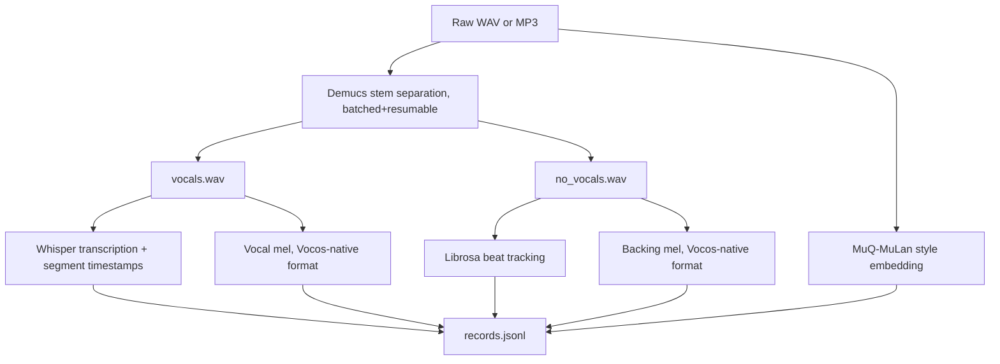

# Vietnamese Audio Preprocessing

This package converts Vietnamese WAV/MP3 files into the structured dataset used
by the conditional diffusion model.

## Workflow



Demucs runs batched (loads its model once per batch of up to 8 files, not once
per file), is resumable (skips files whose stems already exist on disk), and
retries cuda→cpu on failure. If separation fails entirely for a song, or was
skipped dataset-wide via `--skip-demucs`, the record is marked with
`has_vocal: false` and `vocal_source` set to `"raw_mix_fallback"` (whole mix used
as backing, `--skip-demucs` mode) or `"silence_fallback"` (Demucs was attempted
but failed for just this song). Such records are useful for pipeline smoke
tests, but not for evaluating singing quality.

A MuQ-MuLan (`OpenMuQ/MuQ-MuLan-large`) style embedding is also computed once
per song, from the first 10s of the original mix — this is the real "Audio
Style Anchor" the model conditions on (see `docs/architecture.md`). If
the optional `muq` package isn't installed, this degrades to a zero vector
rather than failing the whole record.

## Usage

```powershell
uv run python cli.py preprocess-raw --input dataset/vietnamese_songs --output dataset/diff_rhythm_dataset --whisper-model base
```

The input directory is scanned recursively for `.wav` and `.mp3` files. Use
`--max-files` to limit a run, `--keep-separated-count` to keep selected Demucs
WAV files for inspection, `--skip-demucs`/`--skip-asr` to skip stem separation
or transcription for a fast approximate mode, and `--demucs-device`/
`--whisper-device` to force `cuda`/`cpu` instead of auto-detecting.

## Output Contract

```text
diff_rhythm_dataset/
  config.json
  records.jsonl
  mels/<song>_backing.pt
  mels/<song>_vocal.pt
  mels/<song>_style.pt
```

Each record contains `text` (full transcript), `segments` (word/segment-level
ASR timestamps, used to align cropped lyric text to cropped audio during
training), `style`, `bpm`, `frames`, `has_vocal`, `vocal_source`,
`demucs_separated`, `backing_mel_path`, `vocal_mel_path`, and
`style_embed_path`.

**Mel format matches Vocos's own native feature extractor exactly**
(`charactr/vocos-mel-24khz`: 100 mels, 24kHz, n_fft=1024, hop=256, magnitude mel
with `power=1`, natural log with a `1e-7` floor, **no** upper clip) — see
`compute_mel_spectrogram()` in `src/models/text_to_music_diffusion.py` and
`docs/project_history.md` §4.1 for why this specific format matters: an
earlier 64-mel/16kHz/log-power convention here was the root cause of severely
distorted generated audio, fixed this way and verified to restore >0.99
log-mel correlation on real audio.

## Optional: converting to latent-space (64-dim/5Hz)

The dataset above is mel-space, consumed directly by
`train-self --architecture microdit` (the default). To instead train the
student inside DiffRhythm2's own compressed Music VAE latent space
(`--architecture native_dit`), run `cli.py precompute-latent-dataset` on top of
this output — it re-decodes each record's mel through Vocos, re-encodes with a
trained `LatentAudioEncoder`, and writes a new dataset directory with the same
`records.jsonl`/`config.json` shape but `mels/*.pt` holding 64-dim/5Hz latents
instead of mel tensors, plus `config.json`'s `latent_mode: true`. See
`docs/usage.md` and `docs/project_history.md` §4.24 for the full
procedure (training the encoder first, its known collapse failure mode, and
the fix).
