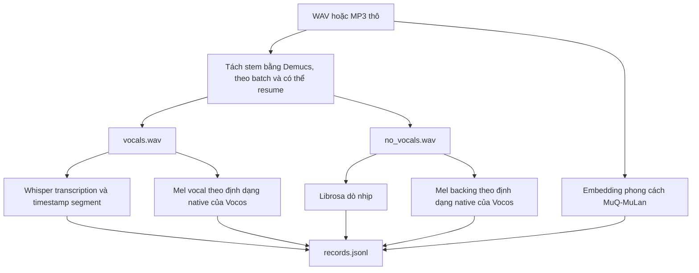

# Tiền xử lý audio tiếng Việt

> Bản Việt hóa của `docs/data_preparation.md`. Lệnh, tên trường và tên thành
> phần phần mềm được giữ nguyên để đối chiếu với mã nguồn.

Package này chuyển các file WAV/MP3 tiếng Việt thành dataset có cấu trúc cho
model conditional diffusion.

## Quy trình



Demucs chạy theo batch, chỉ nạp model một lần cho tối đa 8 file thay vì mỗi
file một lần. Tiến trình có thể resume bằng cách bỏ qua file đã có stem trên
đĩa và sẽ thử lại từ CUDA sang CPU khi lỗi. Nếu một bài tách stem thất bại
hoàn toàn, hoặc cả dataset được chạy với `--skip-demucs`, record được đánh dấu
`has_vocal: false`; `vocal_source` là `"raw_mix_fallback"` khi dùng toàn bộ
mix làm backing trong chế độ `--skip-demucs`, hoặc `"silence_fallback"` khi
Demucs chỉ thất bại ở bài đó. Các record này hữu ích cho smoke test pipeline
nhưng không phù hợp để đánh giá chất lượng giọng hát.

Mỗi bài còn có một embedding phong cách MuQ-MuLan
(`OpenMuQ/MuQ-MuLan-large`) được tính một lần từ 10 giây đầu của mix gốc. Đây
là “Audio Style Anchor” thật mà model dùng để conditioning. Nếu package tùy
chọn `muq` chưa được cài, giá trị này suy giảm thành vector 0 thay vì làm hỏng
toàn bộ record.

## Cách dùng

```powershell
uv run python cli.py preprocess-raw --input dataset/vietnamese_songs --output dataset/diff_rhythm_dataset --whisper-model base
```

Thư mục input được quét đệ quy để tìm `.wav` và `.mp3`. Dùng `--max-files` để
giới hạn số file; `--keep-separated-count` để giữ một số WAV do Demucs tách
cho việc kiểm tra; `--skip-demucs`/`--skip-asr` để bỏ tách stem hoặc nhận dạng
trong chế độ gần đúng nhanh; và `--demucs-device`/`--whisper-device` để ép
`cuda`/`cpu` thay vì tự phát hiện.

## Hợp đồng output

```text
diff_rhythm_dataset/
  config.json
  records.jsonl
  mels/<song>_backing.pt
  mels/<song>_vocal.pt
  mels/<song>_style.pt
```

Mỗi record có `text` (transcript đầy đủ), `segments` (timestamp cấp từ hoặc
segment từ ASR, dùng để căn lyric crop với audio crop khi train), `style`,
`bpm`, `frames`, `has_vocal`, `vocal_source`, `demucs_separated`,
`backing_mel_path`, `vocal_mel_path` và `style_embed_path`.

**Định dạng mel khớp chính xác bộ trích xuất đặc trưng native của Vocos**
(`charactr/vocos-mel-24khz`: 100 mel, 24 kHz, n_fft=1024, hop=256, magnitude
mel với `power=1`, log tự nhiên với sàn `1e-7`, **không** clip phía trên).
Xem `compute_mel_spectrogram()` trong
`src/models/text_to_music_diffusion.py`. Quy ước 64-mel/16 kHz/log-power cũ là
nguyên nhân gốc khiến audio sinh bị méo nặng; định dạng hiện tại đã khôi phục
log-mel correlation trên audio thật lên trên 0,99.

## Tùy chọn: chuyển sang latent-space (64 chiều/5 Hz)

Dataset trên ở mel-space và được `train-self` dùng trực tiếp. **Bước chuyển
đổi này là bắt buộc cho `train-distill`**: `KnowledgeDistillationTrainer`
luôn yêu cầu `config.latent_mode=True` và sẽ lỗi ngay nếu không thỏa; không còn
đường distillation mel-space.

Để huấn luyện student trong không gian Music VAE nén của DiffRhythm2, chạy
`cli.py precompute-latent-dataset` trên output này. Lệnh decode mel bằng Vocos,
encode lại bằng một `LatentAudioEncoder` đã huấn luyện và ghi dataset mới có
cùng dạng `records.jsonl`/`config.json`, nhưng `mels/*.pt` chứa latent 64
chiều/5 Hz và `config.json` có `latent_mode: true`. Xem `docs/usage.md` để biết
quy trình đầy đủ, gồm việc huấn luyện encoder trước và failure mode collapse
đã biết.

## Tùy chọn: `--raw-audio` (giữ waveform, bỏ hoàn toàn mel)

`preprocess-raw --raw-audio` bỏ `compute_mel_spectrogram()` và lưu stem
vocal/backing thành tensor waveform 24 kHz tại
`waveforms/<song>_{vocal,backing}.pt`, shape `(samples,)`, cùng
`raw_audio_mode: true` trong `config.json`. Whisper và embedding MuQ-MuLan vẫn
chạy như pipeline mặc định, nên các trường `text`, `segments` và
`style_embed_path` không đổi; chỉ các khóa đường dẫn audio trở thành
`vocal_wav_path`/`backing_wav_path`.

Chế độ này phục vụ `LatentAudioEncoder` trong `src/models/latent_codec.py`, vốn
nhận waveform thô qua `Conv1d(1, ...)`. Với dataset mel,
`train-latent-encoder`/`precompute-latent-dataset` phải khôi phục audio gần
đúng bằng Vocos trước. Với dataset `raw_audio_mode: true`, hai lệnh cộng trực
tiếp tensor vocal/backing đã tách và bỏ Vocos; encoder vì vậy học trên bản ghi
gốc thay vì bản tái dựng.

```powershell
uv run python cli.py preprocess-raw --input dataset/vietnamese_songs --output dataset/raw_audio_dataset --whisper-model base --raw-audio
```

Trên Kaggle dùng `scripts/run_kaggle_preprocess_raw_audio.py`. Để preprocess
mọi phần trong `RAW_DATASETS`, dùng
`scripts/run_kaggle_multi_part_preprocess_raw_audio.py`. Script gửi tối đa
`--max-new-jobs` kernel, theo dõi job đã gửi trong
`outputs/kaggle_datasets_preparation/submitted_state.json`, và
`--wait-and-loop` tự nối các phần còn lại mà không tạo job trùng.

`cli.py train-latent-encoder --dataset` nhận nhiều thư mục output và gộp thành
một tập huấn luyện; `--max-records-per-dataset` giới hạn đóng góp của mỗi thư
mục trước khi gộp. `scripts/run_kaggle_latent_encoder.py` hỗ trợ trực tiếp các
option này và shortcut `--raw-audio-part 1 2 3 4 5 6`. Ví dụ
`--raw-audio-part 1 2 3 4 5 6 --max-records-per-dataset 1` tạo smoke test 6
record, mỗi phần một bài. `precompute-latent-dataset` hiện chưa hỗ trợ nhiều
thư mục nguồn.
