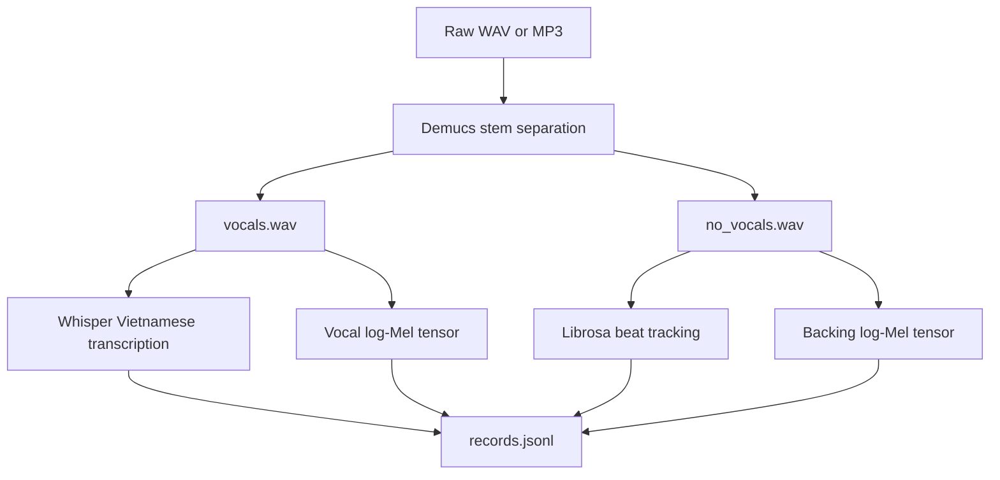

# Vietnamese Audio Preprocessing

This package converts Vietnamese WAV/MP3 files into the structured dataset used
by the self-authored diffusion model.

## Workflow



Demucs is used when available. If separation fails, preprocessing keeps the
existing zero-vocal fallback for compatibility and marks the record with
`has_vocal: false` and `vocal_source: "zero_fallback"`. Such records are useful
for pipeline smoke tests, but not for evaluating singing quality.

## Usage

```powershell
uv run python cli.py preprocess-raw --input dataset/vietnamese_songs --output dataset/diff_rhythm_dataset --whisper-model base
```

The input directory is scanned recursively for `.wav` and `.mp3` files. Use
`--max-files` to limit a run and `--keep-separated-count` to keep selected
Demucs WAV files for inspection.

## Output Contract

```text
diff_rhythm_dataset/
  config.json
  records.jsonl
  mels/<song>_backing.pt
  mels/<song>_vocal.pt
```

Each record contains `text`, `style`, `bpm`, `frames`,
`backing_mel_path`, `vocal_mel_path`, `has_vocal`, and `vocal_source`. Each Mel
tensor has shape `(64, frames)` and is clipped to the log range `[-5.0, 3.0]`.
