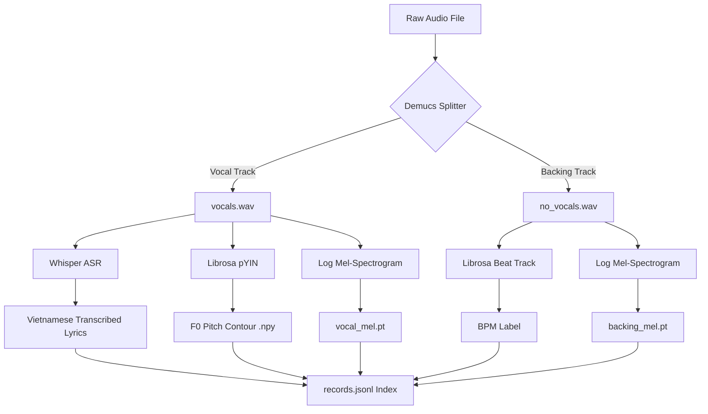

# Vietnamese Audio Preprocessing Pipeline

This package contains data utilities to preprocess raw audio files (Vietnamese vocal/instrumental songs) into the structured training format required by our **Music Self-Diffusion Model** (similar to DiffRhythm's conditioning design).

---

## 🔄 Pipeline Workflow

When raw audio files (`.wav` or `.mp3`) are processed, they pass through the following automated pipeline stages:



1. **Vocal & Instrumental Separation:** Separates voice (`vocals.wav`) from backing tracks (`no_vocals.wav`) using **Demucs**.
2. **Speech-to-Text Transcription:** Transcribes Vietnamese lyrics from the vocal stem using **OpenAI Whisper**.
3. **Melody / Pitch Extraction:** Extracts the continuous fundamental frequency (F0 contour) of the voice using **pYIN** (Probabilistic YIN) and saves it as a NumPy array.
4. **BPM Detection:** Analyzes the backing track tempo using Librosa's beat tracking.
5. **Log Mel-Spectrogram Conversion:** Computes and log-compresses the Mel-spectrograms of both stems, clipping amplitudes to `[-5.0, 3.0]`, and saves them as PyTorch `.pt` tensors.

---

## 🛠️ Setup & Prerequisites

Make sure the required preprocessing dependencies are installed in your environment:

* **Using `uv`:**
  ```powershell
  uv pip install openai-whisper demucs
  ```

* **Using `pip`:**
  ```powershell
  pip install openai-whisper demucs
  ```

---

## 🚀 Usage Guide

You can run the pipeline directly inside the project root namespace using the command-line interface:

* **Using `uv`:**
  ```powershell
  uv run python cli.py preprocess-raw --input dataset/vietnamese_songs --output dataset/diff_rhythm_dataset --whisper-model base
  ```
* **Without `uv`:**
  ```powershell
  python cli.py preprocess-raw --input dataset/vietnamese_songs --output dataset/diff_rhythm_dataset --whisper-model base
  ```

### CLI Arguments Configuration
* `--input`: Folder containing raw `.mp3` or `.wav` music files (default: `dataset/vietnamese_songs`).
* `--output`: Destination directory for the generated dataset (default: `dataset/diff_rhythm_dataset`).
* `--whisper-model`: The size of the OpenAI Whisper model to use (`tiny`, `base`, `small`, `medium`, `large-v3`) (default: `base`).

---

## 📦 Output Format Specifications

After completion, the output directory will contain:

```text
diff_rhythm_dataset/
├── config.json            # Spectrogram specs (sample_rate, hop_length, n_mels)
├── records.jsonl          # Metadata lines pointing to feature paths
├── separated/             # Separated source audio (vocals.wav, no_vocals.wav)
├── mels/                  # PyTorch Mel-spectrogram tensors (.pt)
└── pitch/                 # NumPy F0 pitch arrays (.npy)
```

### 📄 Metadata Index (`records.jsonl`) Schema

Each sample is recorded as a single JSON line:
```json
{
  "id": "song_01",
  "text": "Lòng em nghe tình yêu vỡ tan...",
  "style": "Vietnamese music, 93 BPM, emotional melody",
  "bpm": 93,
  "frames": 23908,
  "backing_mel_path": "mels/song_01_backing.pt",
  "vocal_mel_path": "mels/song_01_vocal.pt",
  "f0_path": "pitch/song_01_f0.npy"
}
```
* **`frames`**: Sequence length of the Mel spectrogram.
* **`backing_mel_path`**: Path to the backing track Mel tensor of shape `(64, frames)`.
* **`vocal_mel_path`**: Path to the vocals track Mel tensor of shape `(64, frames)`.
* **`f0_path`**: Path to the 1D F0 melody pitch array of shape `(frames,)`.
